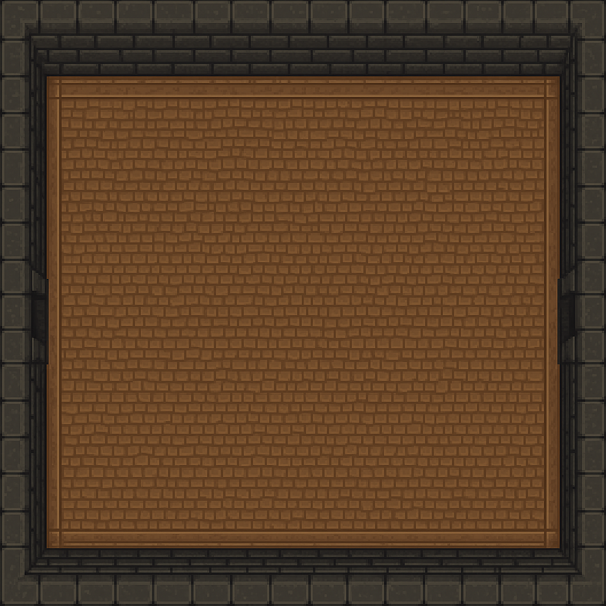

# Dungeon Crawler – Grupo 13

Projeto desenvolvido no âmbito da unidade curricular **Programação e Algoritmos** da **Licenciatura em Engenharia Informática – IADE (2024/2025)**.

---

## Índice

- [Autoria](#-autoria)
- [Sobre o Projeto](#-sobre-o-projeto)
- [Conceitos e Padrões Aplicados](#-conceitos-e-padrões-aplicados) 
- [Objetivos de Aprendizagem](#-objetivos-de-aprendizagem)
- [Funcionalidades Implementadas](#-funcionalidades-implementadas)
- [Tecnologias Utilizadas](#️-tecnologias-utilizadas)
- [Estrutura do Projeto](#-estrutura-do-projeto)
- [Preview](#-preview)
- [Entregas](#-entregas)
- [Repositório](#-repositorio)

---

## Autoria

**Nome:** André Duarte  
**Número de Aluno:** 20241984  
**Grupo:** 13  
**Curso:** Licenciatura em Engenharia Informática  
**Ano Letivo:** 2024/2025  
**Instituição:** IADE – Faculdade de Design, Tecnologia e Comunicação

---

## Sobre o Projeto

Este projeto consiste na criação de um jogo **2D Dungeon Crawler**, com movimentação baseada em teclas, colisões, recolha de itens e navegação em mapa com recurso a algoritmos de pathfinding. Foi utilizado o padrão **Entity-Component-System (ECS)** e conceitos fundamentais de **OOP, DRY, SOLID** e **estruturas de dados (grafos, listas, nós)**.

---

## Conceitos e Padrões Aplicados

### Programação Orientada a Objetos (OOP)

- Utilização de **encapsulamento** através de atributos e métodos privados.
- Implementação de **herança** em entidades como `PlayerEntity` que herda de `Entity`.
- **Polimorfismo** com interfaces como `IRenderable` e `IUpdatable`, aplicadas a múltiplos componentes.
- **Abstração** através da separação clara entre lógica de jogo, renderização e entidades.

### Princípio DRY (Don't Repeat Yourself)

- Reutilização de componentes como `MovementComponent`, `HealthComponent` e `RenderComponent` em diferentes entidades.
- Criação de lógicas genéricas e modulares, como `EntityFactory`, que previnem repetição de código.

### Princípios SOLID (parcialmente implementados)

- **S – Single Responsibility:** cada classe cumpre uma função bem definida (ex.: `MapParser`, `AStarPathfinder`).
- **O – Open/Closed:** é possível adicionar novos componentes sem modificar os existentes.
- **L – Liskov Substitution:** subclasses mantêm o comportamento esperado da superclasse (ex: `Player` substitui métodos de `Entity`).
- **I – Interface Segregation:** interfaces distintas com responsabilidades únicas (`IRenderable`, `IUpdatable`).
- **D – Dependency Inversion:** o uso de fábricas (`EntityFactory`) aproxima-se deste princípio.

### Estruturas de Dados

- **Grafos** representados por `Graph.java` e `Node.java`, usados para modelar o mundo navegável.
- **Listas** para armazenar entidades e caminhos gerados.
- **Algoritmo A\*** aplicado ao grafo para encontrar o caminho ótimo até ao destino.
- Leitura do mapa a partir de ficheiro `.txt`, convertendo texto em nós conectados no grafo.

---

## Objetivo do Projeto

Criar um jogo 2D do tipo **Dungeon Crawler**, aplicando os princípios da programação orientada a objetos, estruturas de dados e padrões de design. O jogador explora masmorras, desvia-se de inimigos, apanha itens e movimenta-se num mapa definido em ficheiro.

---

## Funcionalidades até ao Checkpoint

- Sistema **Entity-Component**
- Movimento do jogador com teclas direcionais
- **Câmara dinâmica** centrada no jogador
- Renderização por camadas
- **Deteção de colisões** com paredes e itens
- Recolha de **corações de vida**
- Sistema de **vida com HUD gráfica**
- Algoritmo **A\*** de pathfinding funcional
- Leitura de mapa a partir do ficheiro `map.txt`

---

## Tecnologias Utilizadas

- **Java 17**
- **libGDX**
- **Gradle**
- **IntelliJ IDEA**
- **Git/GitHub**

---

## Estrutura do Projeto

```plaintext
DungeonCrawler/
├── core/                     # Módulo principal com lógica de jogo
│   ├── components/           # Movimento, Render, Vida, Colisão
│   ├── entities/             # Player, Inimigos, Entidade base
│   ├── map/                  # Parser do mapa, Grafo, Node
│   ├── pathfinding/          # Algoritmo A*
│   ├── enums/                # Estados do jogador e inimigos
│   ├── events/               # Sistema de eventos (Observer Pattern)
│   ├── factories/            # Factory Pattern para entidades
│   └── MainGame.java         # Controlador principal do jogo
│
├── desktop/                  # Launcher desktop
│   └── DesktopLauncher.java
│
├── lwjgl3/                   # Suporte para execução com LWJGL3
│   └── Lwjgl3Launcher.java
│
├── assets/                  # Recursos do jogo (sprites, mapas)
│   ├── sprites/
│   ├── textures/
│   └── maps/map.txt
│
├── build.gradle             # Configuração Gradle
├── settings.gradle
└── README.md
```

---
## Preview


---

## Entregas

- **Checkpoint:** 22 de maio de 2025 (30%)
- **Relatório Individual + Projeto:** 13 de junho de 2025 (40%)
- **Apresentação Final:** 18 de junho de 2025 (30%)

---

## Repositório

[https://github.com/IADE-LEI2425-P-A/Grupo13](https://github.com/IADE-LEI2425-P-A/Grupo13)
